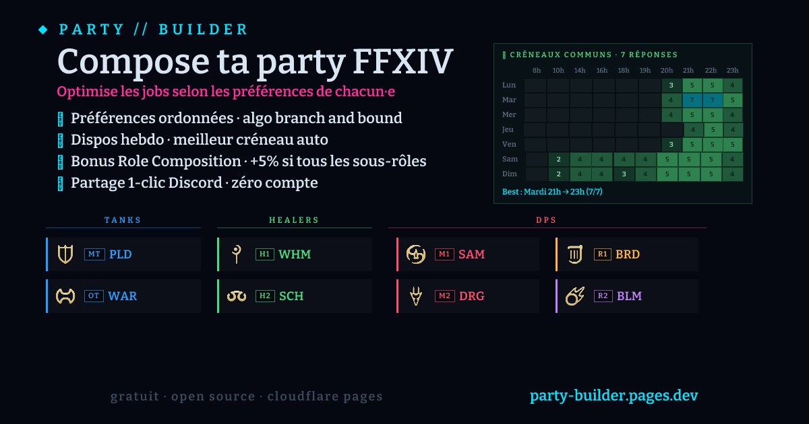

# Party Builder · FFXIV

  

  Outil web d'optimisation de composition de groupe pour <strong>Final Fantasy XIV — Dawntrail</strong>. 
  Chaque joueur·euse entre ses préférences de jobs, l'algo de backtracking + branch & bound calcule la meilleure répartition.

  <a href="https://party-builder.pages.dev">▸ App en ligne</a> ·
  <a href="CONTRIBUTING.md">▸ Contribuer</a> ·
  <a href="DEPLOYMENT.md">▸ Déploiement</a>

---

## Fonctionnalités

### Compo
- **4 types de contenu** : Donjon (4), Raid 8, Alliance Raid 24 (3 × 1T/2H/5DPS), Chaotic Raid 24 (3 × 2T/2H/4DPS)
- **21 jobs Dawntrail** (BLU et BST exclus, comme en raid contenu)
- **Préférences ordonnées par tier** : plusieurs jobs peuvent partager le même rang (ex: PLD favori, autres tanks tous équivalents)
- **Sélection en bloc par rôle** (T H M R C) : un clic pour cocher tous les jobs d'un rôle au même tier
- **Étoile dorée** sur le job favori (tier 0 unique)
- **Slider d'optimisation** : satisfaction globale ↔ frustration limitée (avec modale d'aide qui explique le scoring)
- **Jobs bannis** pour un raid donné (verrou content-level)
- **Verrouillage par joueur·euse** : tu peux trancher une position pour fixer une compo finale
- **Alternatives top-3** (raid 8 et donjon) avec onglets
- **Rôles strat FFXIV** affichés dans la compo finale : badges `MT`/`OT`/`H1`/`H2`/`M1`/`M2`/`R1`/`R2` selon la position dans la grille (utile pour appliquer les strats écrites)

### Disponibilités hebdomadaires
- **Grille 7 jours × 10 heures de début** typiques FFXIV (8h, 10h, 14h, 16h, 18-23h)
- **Click-drag** pour peindre plusieurs cases (souris + tactile, via Pointer Events)
- **Presets rapides** : Soirée semaine / WE aprèm / WE complet / Effacer
- **Dispos par défaut** (synchro cloud par userId) : enregistre ton planning stable une fois, applique-le sur n'importe quel salon
- **Heatmap groupe** repliable au-dessus du roster : densité colorée 0 → 100% des répondant·es, tooltip listant qui manque sur chaque créneau
- **Meilleur créneau** mis en évidence : `Mardi 21h → 23h · 6/8 dispos` (range défini par les heures consécutives où la densité reste max)

### Collaboration
- **Salons partagés via lien court** : `?p=ab3c9X` (ID 6 chars base62, stocké en Cloudflare KV)
- **Auto-save** dès la 1ère modification (création automatique du salon)
- **Identité par navigateur** (userId UUID en localStorage), pas de compte
- **Mon identité** : modale QR code + lien `?import=<b64>` pour transférer ton identité PC ↔ mobile
- **Permissions** :
  - **Owner / admin** : édition totale, peut promouvoir / démoter d'autres admins via la couronne 👑, libérer le claim de n'importe qui (✕)
  - **Non-admin** : auto-claim au 1er touch d'une ligne libre, peut ajouter une nouvelle ligne tant qu'iel est sous la limite de claims, et **Quitter le rôle admin** s'il a été promu par erreur
  - **Limite de réservations** configurable : 1 (raid statique sérieux) / 2 (défaut) / 3 / 4 / illimité
- **Lien de récupération admin** (fragment URL `#admin=SECRET`, jamais transmis au serveur)
- **Synchronisation au focus** + auto-save debounce
- **Flash du titre d'onglet** quand un·e autre member édite pendant que tu es ailleurs
- **Diff visuel sync** : les lignes modifiées par autrui flashent doucement au retour sur l'onglet

### Identités joueur·euse
- **Présence** : OK / ? (peut-être) / ABS (absent·e)
- **Notes par joueur·euse** (200 chars max, lecture par tout·e·s)
- **Presets de préférences** (localStorage + synchro cloud, jusqu'à 5 sauvegardés)
- **Drag & drop** ou flèches ↑↓ pour réordonner (intra-rôle pour la compo)

### Partage
- **Bouton "Partager"** : modale avec URL courte + URL longue (base64 autoporté, fonctionne offline)
- **Export pour Discord** : message markdown formaté avec icônes 🛡️💚⚔️🎯
- **Webhook Discord** : publication 1-clic d'un embed riche (avec image OG dynamique) dans un canal configuré
- **Forcer le refresh Discord** : bouton qui copie l'URL avec un param frais pour que Discord rebuild l'embed (utile après évolution de l'OG)
- **OG image PNG dynamique** générée à la volée (rasterized via workers-og) pour les previews Discord/Twitter
  - Cache KV (clé `og:v<N>:<id>:<lang>:<hash(KV)>`, TTL 7j) pour éviter de re-rasteriser à chaque scrape
  - Affiche aussi le meilleur créneau dispo si ≥ 2 répondant·es

### Mémoire & confort
- **Salons récents** (chips localStorage + synchro cloud, max 5)
- **Templates de compo** (sauvegarde contenu + jobs bannis + fairness pour réutiliser)
- **Duplication** : refais un raid avec mêmes paramètres mais Quand?/claims vierges
- **Undo** sur les actions destructives (Réinitialiser, Retirer, Déverrouiller tout) + Ctrl+Z
- **Bilingue FR / EN** auto-détecté (`navigator.language`)
- **Mobile-friendly** (responsive + drag handles masqués sur touch)
- **Animations douces** (respecte `prefers-reduced-motion`)

---

## Quick start (côté utilisateur·ice)

### Créer et partager une compo

1. Va sur https://party-builder.pages.dev
2. Saisis les noms (ou clique direct sur les jobs : la ligne se nomme automatiquement)
3. Clique sur les icônes des jobs préférés, ou utilise **T / H / M / R / C** pour cocher tout un rôle d'un coup
4. (Optionnel) Renseigne "Quoi/Quand?", bannis des jobs, ajuste le slider, coche tes dispos via 🕐
5. Clique **▸ Partager** → un salon est créé, l'URL est copiable
6. Partage le lien dans Discord ; chacun·e ouvre, touche une ligne libre pour la claim (auto), met ses prefs et ses dispos
7. La heatmap groupe + le meilleur créneau apparaissent dès ≥ 2 personnes ont rempli leurs dispos
8. Quand la compo te convient, clique **◆ Verrouiller tout** pour la valider

### Permissions

- **Toi (créateur·ice)** = owner + admin : tu vois la couronne 👑, tu peux tout modifier, promouvoir des admins, libérer n'importe quel claim
- **Les autres** ouvrent le lien : la modale "Partager" leur affiche seulement les actions non-admin. Iels touchent une ligne libre → auto-claim, peuvent éditer leur ligne + ajouter une autre ligne (dans la limite des claims max du salon)
- Pour donner les pleins pouvoirs à quelqu'un : clique 👑 à côté de leur ligne (une fois qu'iels ont claim quelque chose)
- Pour **conserver l'accès admin en cas de perte de localStorage** : clique **◆ Copier le lien admin** dans la modale Partager, sauvegarde ce lien (il contient un secret en fragment `#admin=...`)
- Pour **quitter le rôle admin** (cas du membre promu par erreur) : bouton **⊘ Quitter le rôle admin** dans la modale Partager

### Discord webhook

Pour publier ta compo dans un canal Discord en 1 clic :

1. Dans Discord : **Paramètres du canal** → **Intégrations** → **Webhooks** → **Nouveau webhook**
2. Copie l'URL générée
3. Dans la modale Partager, clique **▸ Publier sur Discord** → colle l'URL au prompt
4. Le webhook est stocké uniquement dans **ton** localStorage (jamais sur le serveur)
5. Tous tes prochains raids peuvent être publiés en 1 clic dans ce même canal

Si l'embed Discord est stale (cache Discord, ~24h+) après une évolution visuelle : clique **↻ Forcer le refresh Discord** dans la modale, colle le lien fourni dans Discord, l'embed se rebuild.

---

## Architecture (TL;DR)

- **Front** : `index.html` monolithique (~4200 lignes JS), vanilla JS, pas de bundler ni de build step
- **Lib partagée** front + Functions + tests (~250 tests Node) :
  - `lib/jobs.js` — catalogue jobs + content types
  - `lib/scoring.js` — algo de backtracking + branch & bound
  - `lib/coverage.js` — analyse de couverture des rôles dans le roster
  - `lib/codec.js` — encode/decode + validation des payloads
  - `lib/availability.js` — agrégation dispos + heatmap + meilleur créneau
  - `lib/strat-roles.js` — étiquetage MT/OT/H1/H2/M1/M2/R1/R2 par position
  - `lib/discord.js` — embed builders Discord (lazy-loadé)
  - `lib/local-store.js` — wrappers localStorage (presets/templates/recents)
- **Backend** : Cloudflare Pages Functions
  - `POST /api/save` — crée/upsert un salon (avec règles de permissions per-row)
  - `GET /api/load/[id]` — récupère un salon
  - `GET /og/[id]` — génère le PNG OG image via [workers-og](https://github.com/kvnang/workers-og), cache KV 7j
  - `GET/PUT /api/profile` — sync cloud du profil utilisateur·ice (presets, templates, recents, dispos par défaut)
  - `_middleware.js` — réécrit les meta tags OG/Twitter au scrape pour preview Discord
- **Storage** : Cloudflare Workers KV (binding `PARTY_KV`, TTL 1 an, free tier)
- **Rate-limit** : 100 saves/heure/userId via sliding-window counter en KV

Tier gratuit Cloudflare largement suffisant pour un groupe ~20 personnes.

---

## Privacy & data

- Aucun compte, aucun email, aucun cookie tiers
- Identité = UUID aléatoire par navigateur, stocké dans `localStorage` (pas envoyé au serveur sauf en header sur les writes)
- Données stockées en KV : noms saisis, préférences de jobs, dispos hebdo, notes, claims (par userId)
- Profil cloud par userId : presets, templates, salons récents, dispos par défaut
- TTL automatique de 1 an sur chaque salon et chaque profil ; au-delà, suppression automatique
- Webhook Discord : URL stockée uniquement en localStorage, jamais sur le serveur

---

## Dev / contribuer

Voir [CONTRIBUTING.md](CONTRIBUTING.md) pour la config locale, la structure du projet, et les conventions.
